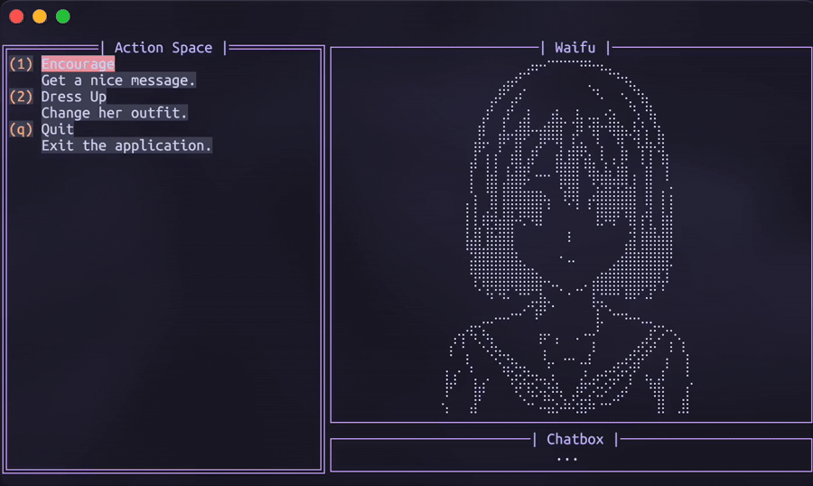

# 🫂 CliWaifuTamagotchi

Preview:

---


## 📑 Table of Contents
- [✨ Overview](#-overview)
- [🎬 Launching Process](#-launching-process)
- [🎨 Customization](#-customization)
- [📂 Project Structure](#-project-structure)
- [⚙️ Core Scripts](#-core-scripts)
    - [main.go](#maingo)
    - [utils/app-utils.go](#utilsapp-utilsgo)
    - [utils/commands-utils.go](#utilscommands-utilsgo)
    - [utils/happiness.go](#utilshappinessgo)
    - [utils/palette-utils.go](#utilspalette-utilsgo)
    - [utils/settings.go](#utilssettingsgo)
- [📜 Notes](#-notes)

---

## ✨ Overview
CliWaifuTamagotchi is a **terminal-based tamagotchi** that:

- Renders **ASCII expressions and clothes**.
- Provides a small set of **interactions**: Encourage, Dress Up, Background Mode, Quit.
- Uses a **persistent color palette** stored in `~/.config/cliwaifutamagotchi/palette.json`.
- Uses **persistent detail settings** stored in `~/.config/cliwaifutamagotchi/settings.json`.
- Has minimal UI built using **`tview` and `tcell`**.
- Has **Vim-style navigation**: Use `h`, `j`, `k`, `l` keys for intuitive navigation and selection (Must be enabled in **settings.json**).

No tons of loops - only one function that repeats itself every 5 seconds. Everything handles and updates according to it.

---

## 🎬 Launching Process

<details>
  <summary>Brew (macOS)</summary>

  1. **Install**

  ```bash
  brew install HenryLoM/CliWaifuTamagotchi/cliwt
  ```

  2. **Run**

  ```bash
  cliwt
  ```

  ---

</details>

<details>
  <summary>Git (Source code) (Linux)</summary>

  1. **Clone repository**

  ```bash
  git clone https://github.com/HenryLoM/CliWaifuTamagotchi.git
  cd CliWaifuTamagotchi
  ```

  2. **Build app yourself, then run**

  ```bash
  go build -o cliwt
  ./cliwt
  ```

  - **Or run directly for development**

  ```bash
  go run main.go
  ```

  ---

</details>

> **💡 Notes**
>
> * First run creates `~/.config/cliwaifutamagotchi/` directory and `palette.json`, `settings.json` files in it on its own if missing.
> * On macOS, ensure your terminal supports **true color** for best rendering.

---

## 🎨 Customization

1. Palette<br>
JSON file is in `~/.config/cliwaifutamagotchi/` ; Named `palette.json`<br>
JSON file's structure:
```
{
  "background": "#1e1e2e",
  "foreground": "#cdd6f4",
  "border": "#cba6f7",
  "accent": "#eba0ac",
  "title": "#b4befe"
}
```
> Note: default palette is Catppuchin (Mocha).

2. Settings<br>
JSON file is in `~/.config/cliwaifutamagotchi/` ; Named `settings.json`<br>
JSON file's structure:
```
{
  "name": "Waifu",
  "defaultMessage": "...",
  "vimNavigation": false,
  "keys": {
    "encourage": "l",
    "dressup": "2",
    "backgroundMode": "b",
    "quit": "q"
  }
}
```
> Note: try to avoid key overrides when using `"vimNavigation": true`.

---

## 📂 Project Structure

```
CliWaifuTamagotchi/
│
├── README.md
├── LICENSE
├── .gitignore
├── result.gif
├── reactions.jpg
├── go.mod
├── go.sum
├── main.go                             # Main file that launches the project
│
└── utils/
    │
    ├── ascii-arts/
    │   ├── clothes/                    # ASCII bodies
    │   └── expressions/                # ASCII heads
    │
    ├── assets/
    │   └── words-of-encouragement.txt  # List of lines for the first function
    │
    ├── app-utils.go                    # Main helpers
    ├── commands-utils.go               # Functions for the Action Space
    ├── happiness.go                    # Happiness scoring system
    ├── palette-utils.go                # Handling palette out of the file
    └── settings.go                     # Handling settings out of the file
```

---

## ⚙️ Core Scripts

### **main.go**

* Loads ASCII **head, blink frames, and body**.
* Displays **actions menu**: Encourage, Dress Up, Quit.
* Handles **user input** (keys and navigation).
* Queues UI updates safely using `app.QueueUpdateDraw` via `UIEventsChan` that keeps UI changes in order.

### **utils/app-utils.go**

* Helper functions for **loading ASCII files**.
* Manages **UI rendering** and **widget updates**.

### **utils/commands-utils.go**

* Implements **interactions logic**:

  * `Encourage`: random encouraging phrase + happy frame.
  * `DressUp`: swaps body/outfit based on selection.
  * `BackgroundMode`: fills the TUI with Waifu, removing all of the odd elements.
* Caches **clothes in memory** to reduce disk reads.

### **utils/happiness.go**

* Handles the bar and changes emotions of the avatar.
* Handles the happiness scores.

### **utils/palette-utils.go**

* Loads palette from `~/.config/cliwaifutamagotchi/palette.json`.
* Creates **default palette** if missing.
* Provides **color application** helpers.

### **utils/settings.go**

* Loads settings from `~/.config/cliwaifutamagotchi/settings.json`.
* Creates **default settings** if missing.

---

## 📜 Notes

* Missing/malformed ASCII files may cause a wrong output; handle carefully if modifying assets inside the structure.
* Future plans:
    * More interactions (feeding, timed events, stats).
    * Save selected outfit and preferences.
    * Unit tests and error handling improvements.
    * Husbando version ("Swap Mode").
    * Maybe "Pose Mode" - loop animation or specific pose to select and have on the background.
    * Maybe handle stderr so Waifu reacts to the errors you get during your work.

---

⤴︎ Return to the [📑 Table of Contents](#-table-of-contents) ⤴︎

## Special thanks

<a href="https://github.com/HenryLoM/CliWaifuTamagotchi/graphs/contributors">
  
</a>
